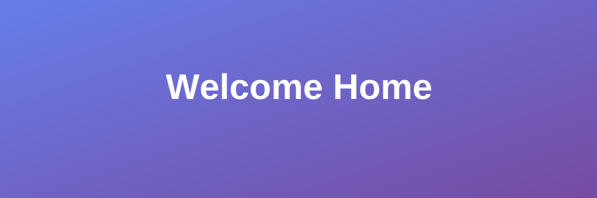

# Welcome to Fictional Lamp

  

## Your Modern Blog Platform

Welcome to **Fictional Lamp**, a modern and accessible blog site built with MkDocs. This site features:

- 🎨 **Beautiful Gradient Theme** - Eye-catching gradients throughout the design
- 🌓 **Light/Dark Mode** - Seamless theme switching for your comfort
- 📱 **Fully Responsive** - Perfect on any device, from mobile to desktop
- ♿ **Accessible** - Built with accessibility in mind following WCAG guidelines
- 🚀 **Fast & Modern** - Powered by MkDocs Material theme

---

## What You'll Find Here

### 📝 Blog Posts
Explore our collection of insightful articles, tutorials, and thoughts. Check out our [Blog section](blog/index.md) to dive into the latest posts.

### 💬 Get in Touch
Have questions or feedback? Visit our [Contact page](contact.md) to reach out to us.

### 🎯 Features

#### Responsive Design
Our site adapts seamlessly to any screen size, ensuring a great experience whether you're on a phone, tablet, or desktop.

#### Accessibility First
We prioritize accessibility with proper ARIA labels, keyboard navigation, and screen reader support to ensure everyone can use our site.

#### Modern Stack
Built with MkDocs and Material theme, deployed to GitHub Pages, and ready for Azure Static Web Apps.

---

## Getting Started

1. **Explore the Blog** - Read our latest posts and articles
2. **Toggle Theme** - Try the light/dark mode switcher in the header
3. **Contact Us** - Reach out through our contact form
4. **Enjoy!** - Browse around and discover what we have to offer

---

*Welcome to your new favorite blog!* ✨
